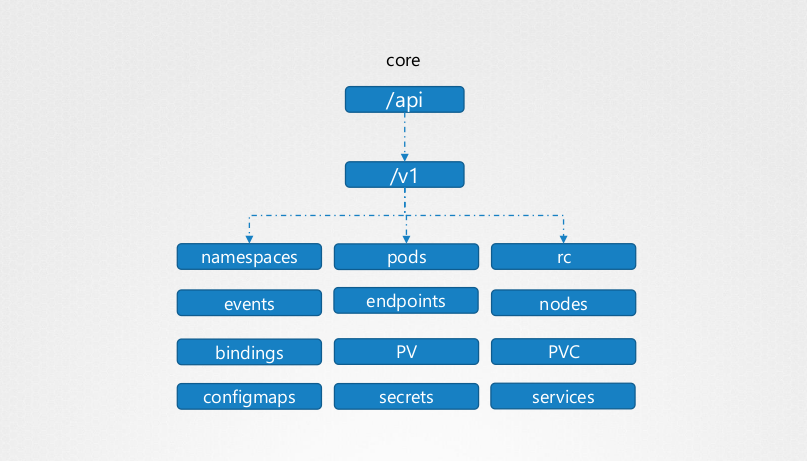
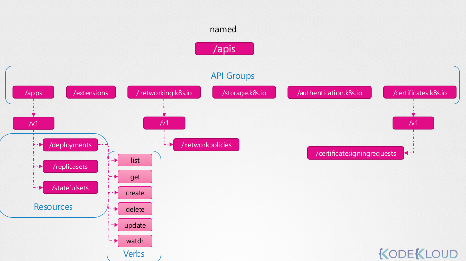
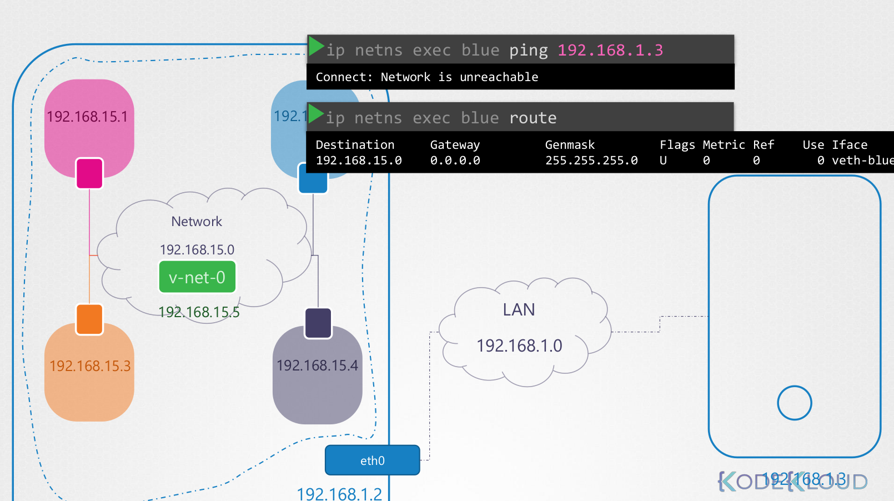
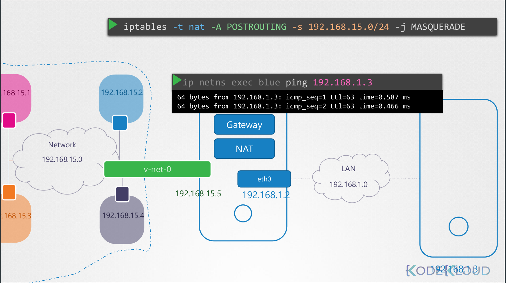

**Generating YAML definitions:**

Create an NGINX Pod
```
kubectl run nginx --image=nginx
kubectl run --generator=run-pod/v1 nginx --image=nginx (deprecated)
```

Generate POD Manifest YAML file (-o yaml). Don't create it(--dry-run)
```
kubectl run  nginx --image=nginx --dry-run=client -o yaml
```

Create a deployment
```
kubectl create deployment --image=nginx nginx
```

Generate Deployment YAML file (-o yaml). Don't create it(--dry-run)
```
kubectl create deployment --image=nginx nginx --dry-run=client -o yaml
```

<br/><br/>
* * *


[k8s_core_concepts.pdf](:/7303ac81e459432a83b9cbf3f2d4bed5)


[k8s_services.pdf](:/159552742ac140dc8235b9ba54012192)


## Creating Pods
We can first generate the POD definition file
`kubectl run redis --image=redis --dry-run=client -o yaml > redis.yml`

`kubectl create -f redis.yml`

To edit the pod:
```
kubectl edit pods redis ( Note this will not make the changes in the pod definition file created previously)
```
(OR)

Edit the POD definition file and then run,
```
kubectl apply -f redis.yml
```

<br/><br/>
* * *


## NameSpace
For listing available namespaces
`kubectl get ns`

List pods in a specific namespace ( By default it uses `default` namespace)
`kubect get pods -n kube-system`

Set config to use specific namespace ( instead of using namespace flag everytime)
`kubectl config set-context $(kubectl config current-context) --namespace=dev`

For listing resources from all namespaces, use
`kubectl get pods --all-namespaces`

To limit resources in NameSpace, we need to create `ResourceQuota`

Examples:
  #### Create a new resourcequota named my-quota
  ```
kubectl create quota my-quota
--hard=cpu=1,memory=1G,pods=2,services=3,replicationcontrollers=2,resourcequotas=1,secrets=5,persistentvolumeclaims=10
```
  
  #### Create a new resourcequota named best-effort
  ```
kubectl create quota best-effort --hard=pods=100 --scopes=BestEffort
```

<br/><br/>
* * *

## Service
Kubernetes service is an object just like pod, replicaset, deployment etc 
#### Service types:
> **NodePort service:** This listens to a port on a node and forwards request on that port to a port on the pod running the web application. This type of service is known as Node port service

> **Cluster IP**: In this case the service creates a virtual IP inside the cluster to enable communication between different services such as a set of frontend servers to a set of backend servers

> **Load Balancer**: This provisions a load balancer for our application in supported cloud providers. An example would be to distribute load across the different web servers in your frontend tier

<br />

**Service - NodePort nuggets**:
	Three ports are involved here.
	**TargetPort**: The port on the POD where the actual service is running is referred to as TargetPort
	**Port**: This is the port on the service itself. It is simply referred to as Port
	**NodePort**: This is the port on the node itself. The port can only be within the range of 30000 - 32767
<br />

Service - NodePort example,
```
apiVersion: v1
kind: Service
metadata:
  creationTimestamp: null
  labels:
    app: my-ns
  name: my-ns
spec:
  ports:
  - name: 5678-8080
    port: 5678
    protocol: TCP
    targetPort: 8080
    nodePort: 30005
  selector:
    app: my-ns
  type: NodePort
status:
  loadBalancer: {}
```

**Note**: Out of the three ports, `port`, `targetPort`, `nodePort` only `targetPort` is mandatory. If no `port` is defined, it'll assume the por to be the same as targetPort. If no `nodePort` is defined, it'll assing a random port automatically in the range 30000-32767

<br />

To create a service using service definition file, run
`kubectl create -f service-definition.yml`

To list the created service, run
`kubectl get services`

<br />

**Service - Cluster IP**
Full stack web applications typically have different kind of pods running, hosting different parts of an application. We may have number of pods running as front-end web servers, number of pods running as back-end server and another set of pods running a keyvalue store like redis and some database as well.

The web front end server needs to communicate to the back-end service and the back-end service need to communicate with redis as well as the database services. This is where cluster IP service comes in. It helps in grouping all the pods for a service and load balances the request. The cluster IP service automatically detects removal or addition of pods for the service it manages. The webserver service connecting to the back-end service just needs to call the cluster IP service name of the back-end service and it takes care of the rest. 

Service Cluster IP example,
```
apiVersion: v1
kind: Service
metadata:
  name: back-end
spec:
  ports:
  - port: 80
    protocol: TCP
    targetPort: 80
  selector:
    app: back-end
  type: ClusterIP
```

To create a cluster IP service using service definition file, run
`kubectl create -f service-definition.yml`

To list the created service, run
`kubectl get services`

<br /><br />
* * *
## Imperative Commands
Deploy a redis pod using the redis:alpine image with the labels set to tier=db.


Either use imperative commands to create the pod with the labels. Or else use imperative commands to generate the pod definition file, then add the labels before creating the pod using the file.

`kubectl run --generator=run-pod/v1 redis --image=redis:alpine -l tier=db`

<br />

Create a service redis-service to expose the redis application within the cluster on port 6379.
`kubectl expose pod redis --port=6379 --name redis-service`
<br />

Create a deployment named webapp using the image kodekloud/webapp-color with 3 replicas
Try to use imperative commands only. Do not create definition files.

Use the command 
`kubectl create deployment webapp --image=kodekloud/webapp-color`
Then scale the webapp to 3 using command 
`kubectl scale deployment/webapp --replicas=3`

<br /><br />
* * *


[k8s_taints_tolerations.pdf](:/b36674b9a9a4466cbd036ec68a134d98)


[k8s_scheduling.pdf](:/ff2f9c977fd64acba496e5e5cae6de54)


## Scheduling

### Manual scheduling:

Manually scheduling the POD using `nodeName`

```
apiVersion: v1
kind: Pod
metadata:
  name: nginx
spec:
  containers:
  -  image: nginx
     name: nginx
  nodeName: node01
  ```

`kubectl create -f nginx.yml`

<br />

### Label and selectors:
We have deployed a number of PODs. They are labelled with 'tier', 'env' and 'bu'. How many PODs exist in the 'dev' environment?
Use selectors to filter the output

`kubectl get pods --selector env=dev`

How many objects are in the 'prod' environment including PODs, ReplicaSets and any other objects?
`kubectl get all --selector env=prod`

Identify the POD which is 'prod', part of 'finance' BU and is a 'frontend' tier?
`kubectl get all --selector env=prod,bu=finance,tier=frontend`

<br />

### Taints and tolerance:
> Taints and tolerations are only meant to restrict nodes from accepting certain POD's. It `does not` tell the POD to which node it has to go.  Taints are set on nodes and tolerance is set on pods


Tainting Node example,
`kubectl taint nodes node-name key=value:taint-effect`

`kubectl taint nodes node1 app=blue:NoSchedule`

> taint-effect defines what would happen to the POD if they do not tolerate. taint-effect can be `NoSchedule` | `PreferNoSchedule` | `NoExecute`,  
NoSchedule - This flag ensures that POD's that do not have tolerance will not be scheduled in this node
PreferNoSchedule - System will try to avoid placing a POD in this node but that is not guaranteed
NoExecute - New POD's will not be scheduled on the nodes and existing POD's if any will be evicted


Tolerance definition example:
```
apiVersion:
kind: Pod
metadata:
  name: myapp-pod
spec:
  containers:
  - name: nginx-controller
    image: nginx

  tolerations:
    - key: "app"
      operator: "Equal"
      value: "blue"
      effect: "NoSchedule"
```

By default the k8s master node does not allocate pods to itself ( other than the ones as part of kube-system namespace ) by using `taints`. We can check this by running,
`kubectl describe node kubemaster | grep Taint`

Removing taints from master node,
`kubectl taint nodes master node-role.kubernetes.io/master:NoSchedule-`

<br />

### Node Selectors
This can be used to target nodes based on labels attached to the node. Refer the example file below,

```
apiVersion:
kind: Pod
metadata:
  name: myapp-pod
spec:
  containers:
  - name: nginx-controller
    image: nginx
  nodeSelector:
    size: Large
```

Here option `nodeSelector` is used to select the desired node. `size: Large` is the label that is assigned to the node. Prior to creating this POD, a label should be attached to the corresponding node. To label a node we can run,

`kubectl label nodes node01 size=Large`

**Note:** NodeSelector does have its limitations. For eg, if we had to ensure the pod runs either on machine with label of size as `Medium` or `Large`, we cannot achieve this using NodeSelector. This can be done using Node Affinity.

<br />


### Node Affinity

Example definition for Node Affility,

```
apiVersion:
kind: Pod
metadata:
  name: myapp-pod
spec:
  containers:
  - name: data-processor
    image: data-processor
  affinity:
    nodeAffinity:
      requiredDuringSchedulingIgnoredDuringExecution:
        nodeSelectorTerms:
          - matchExpressions:
              - key: size
                operator: In
                values:
                  - Large
                  - Medium
```

Node Affinity Types:
- requiredDuringSchedulingIgnoredDuringExecution
- preferredDuringSchedulingIgnoredDuringExecution
- requiredDuringSchedulingRequiredDuringExecution


The type of node affinity defines the behaviour of the scheduler with respect to node affinity and the stages in the lifecycle of the POD. 

<br />

|  | DuringScheduling | DuringExecution|
|--|--|--|
| Type 1 | Required  | Ignored |
| Type 2 | Preferred | Ignored |
| Type 3 | Required | Required |

<br />
Consider a scenario where the matching labels defined in affinity are not available in any of the nodes. This is where the type of node affinity comes into play. 

Based on the above case
Type 1 - During scheduling if no labels match the ones defined in affinity, the corresponding POD's will not be scheduled. This type is used when the placement in the POD is crucial. `DuringExecution` indicates what to do with already running pods. `Ignored` values indicates any changes in runtime will be ignored and the POD will continue to run.

Type2: For this case, the `Preferred` type will check for matching nodes and schedule it if found. If the node is not found, it'll ignore and schedule it to any other available node. This is more of Best Effort. `DuringExecution` state for this type is same as type1

Type3: Required for both `DuringScheduling` and `DuringExecution` is self explanatory based on other two types


**Note:** Taint & Tolerations and Node Affinity can be used in conjunction

<br />


### Resource Requirements and Limits

The scheduler places the POD's on worker nodes where sufficient resources are available. When requested resources by POD's are not met, the scheduler holds back scheduling the POD's. 

**Resource Requests:**  The minimum amount of CPU or Memory requested by the container. The scheduler uses these values to identify the right node to place the POD.
**Resource limit:** In the docker world, the Docker container has no limit to the resource it can consume on a node. Say a container starts with 1vCPU on a node, it can go up and can use as much resource as it requires suffocating the natvie process on the node or other container of resources. We can set the resource limit for the pods.  

Eample for resource requests and limits

```
apiVersion:
kind: Pod
metadata:
  name: simple-webapp-color
  labels:
    name: simple-webapp-color
spec:
  containers:
  - name: simple-webapp-color
    image: simple-webapp-color
    ports:
      containerPort: 8080
    resources:
      requests:
        memory: "1Gi"
        cpu: 1
      limits: 
        memory: "2Gi"
        cpu: 2
```

**Note:**  Resource requests and limits are set for each container on the pod. The container can consume more memory than its limit. It the container does this constantly, the pod will be terminated.


<br />

### Daemon Sets

Daemon sets are like replica sets, as it helps you to deploy multiple instances of POD. But it runs one copy on each node in your cluster.
Whenever a new node is added to the cluster, a replica of that pod is added to that node. When the node is removed, the pod is automatically removed. 

Use Cases:
- As monitoring agent for collecting logs
- Kube Proxy component
- Weave-net requires an agent running on each node

Example for DaemonSet Definition,
```
apiVersion: apps/v1
kind: DaemonSet  
metadata:
  name: monitoring-daemon
spec:
  selector:
    matchLabels:
      app: monitoring-agent
  template:
    metadata:
      labels:
        app: monitoring-agent
    spec:
      containers:
        - name: monitoring-agent
          image: monitoring-agent
```

**Note:** starting from v1.12 the DaemonSet uses NodeAffinity and default scheduler to schedule pods on nodes. Prior to that, it used `nodeName` as we see in manualy scheduling

<br />

### Static Pods
We can create a pod without the help of KubeAPI, scheduler or controller components of k8s. We can place a pod definition file under `/etc/kubernetes/manifests` directory in one of the nodes and the `kubelet` will pick this change and creates a pod. However, we cannot create ReplicationSet, Deployments etc which requires KubeAPI, controllers etc. 

**Important:**
The `manifests` directory is configurable and can be changed. It can be any directory on the host. The location of this directory is passed in to the kubelet as an option while running the service. 
For eg, this can be found in `kubelet.service` systemd service file whit the flag `--pod-manifest-path=/etc/kubernetes/manifests`. 
There is also another way of configuring this. Instead of passing the flag directly in the kubelet service file, we can provide a path to another config file `--config=kubeconfig.yaml`. The option inside the kubeconf.yaml file would be `staticPodPath: /etc/kubernetes/manifests`

<br />

> The KubeAPI server is aware of the static pods we create. But they cannot be modified or deleted using kubectl. We can only modify or delete them from the manifests folder on the corresponding node. The thing we see through kube-apiserver is a read only mirror of the pod


Why would we use static pods?
We can use static pod to deploy the control plane components itself as pods on a node. We can start by installing kubelet on all the master nodes and then create pod definitions file that uses docker images of various control plane components (scheduler, api-server etc). Place the definitions file in the designated manifests folder and the kubelet takes care of deploying the control plane components themselves as pods on the cluster. This way we don't have to deal with downloading the binaries, configure services, worry about the services crashing. This is how the `kubeadm` tool sets up the kubernetes cluster. 

<br />

**Difference between static PODs and DaemonSets**


|   Static PODs | DaemonSets|
|--|--|
| Created by kubelet | Created by Kube-API server (DaemonSet Controller)  | 
| Deploy Control Plane components as static PODs | Deploy monitoring agents, Logging agents on nodes |
| Ignored by the Kube scheduler | Ignored by the Kube scheduler |

<br />


### Multiple Schedulers
We can go with manual custom schedulers if the out of the box scheduler does not meet our requirement. For example, say you have a specific application that requires its components to be placed on nodes after performing some additional checks. 

k8s is highly extensible. We can write our own kube-scheduler program, package it and deploy it and use it as default or additional scheduler in kubernetes cluster. k8s cluster can have multiple schedulers the same time. 

If scheduler name is not specified, it assumes the name of default-scheduler. This is the default scheduler. 

Sample systemd service file for scheduler, 

`kube-scheduler.service`
```
ExecStart = /usr/local/bin/kube-scheduler \\
  --config=/etc/kubernetes/config/kube-scheduler.yml \\
  --scheduler-name=default-scheduler
```

`my-custom-scheduler.service`
```
ExecStart = /usr/local/bin/kube-scheduler \\
  --config=/etc/kubernetes/config/kube-scheduler.yml \\
  --scheduler-name=my-custom-scheduler
```

To deploy an additional scheduler, we may use the same kube-scheduler binary or use one that you might have built for yourself. `--scheduler-name` is important here and this what we specify in POD definition file to indicate which scheduler to use


Example for POD using custom scheduler,

```
apiVersion:
kind: Pod
metadata:
  name: myapp-pod
spec:
  containers:
  - name: nginx-controller
    image: nginx
  schedulerName: my-custom-scheduler
```

Use `kubectl get events` command to know which scheduler picked it up. This would list all events in the current namespace. 

To view the logs of the scheduler, run
`kubectl logs my-custom-scheduler -n kube-system`

<br /> <br />


* * *

[k8s_logging.pdf](:/09741ea0a8b14299a082df867c8d8252)


## Logging and Monitoring
* * *

As of 18 Oct 2018, kubernetes does not have built in monitoring solution. However there are number or open source solutions like metrics server, prometheus, Elastic stack, datagod, dynatrace etc. 


Heapster was one of the original project that enabled monitoring and analysis features for kubernetes. Heapster is now deprecated and a slimmed down version was developed called `metric-server`. You can have one metric-server per kubernetes cluster. 

The metrics server retrieves metrics from each of the kubernetes nodes and pods, aggregated them and stores them in memory. Note that the metric-server is only an `in-memory` monitoring solution and does not store the metrics on the disk. Hence we cannot see historical performance data. For that we must rely on one of the advanced monitoring solution discussed earlier. 


How are the metrics generated for the PODs on the nodes?
Kubernetes runs an agent on each node known as the `kubelet` which is responsible for receiving instructions from the kubernetes API master and run pods on the nodes. The kubelet also contains sub-component known as the `c-Advisor`. c-Advisor is responsible for receving performance metrics from the PODs and exposing them through the kubelet-api to make the metrics available for the metrics server. 


If using minikube, run
`minikube addons enable metrics-server`

for others,
`kubectl apply -f https://github.com/kubernetes-sigs/metrics-server/releases/download/v0.3.6/components.yaml`


Once deployed, we can run

`kubectl top node` to get node metrics

`kubectl top pod` to get pod metrics

<br />

**Logging**

`kubectl logs -f <pod_name>` is used for tailing pod logs. If the pod contains more than one container, then

`kubectl logs -f <pod_name> <container_name>` 


<br /> <br />

* * *


[k8s_application_lifecycle.pdf](:/75a17be1abeb434b8e8a8feb218b99e0)


## Application Lifecycle Management
* * *


### Rolling Updates and Rollbacks in Deployments

**Rollouts and versioning in a deployment:** When we first create a deployment it triggers a rollout. A new rollout creates a new deployment revision. In the future if new revision is created ( updating to new image ), a new new deployment revision is created. We can see the status of the rollout by runnning,

`kubectl rollout status deployment/myapp-deployment`

To view the history of deployments, run
`kubectl rollout history deployment/myapp-deployment`

**Deployment Strategy:** There are two types of deployment strategy. 
- One way to upgrade to newer version is to delete all the existing pods and create new ones. The problem with this would obviously be downtime. This strategy is called re-create strategey. This 'is not' the default deployment strategy.
- In the second strategy, Deployment is done one pod at a time. No downtime in this case. This is called the Rolling Update strategy. This is the default deployment strategy

<br />

The update is done by making changes to deployment definition file and running,

`kubectl apply -f deployment-definition.yml`

One other way to make the update on the fly is by running,

`kubectl set image deployment/myap-deployment nginx=nginx:1.9.1`

Remember the above command will not make changes to the deployment definition file. 

<br />

For Rolling update the strategy k8s follow is, initially during the first deployment it creates resplica set for that sepecific deploy. Later on during the upgrade, k8s creates another replica set and starts creating pods in the new replica set and simultaneously removing pods in the old replicasets one at a time. 

<br />

**Rollback**
k8s deployments allow you to rollback to previous revision. To rollback to previous version of the deployment run,

`kubectl rollout undo deployment/myapp-deployment`

<br />


| Type |Summary of deployment commands |
|--|--|
| Create | `kubectl create -f deployment-definition.yml`|
| Get |  `kubectl get deployments`|
| Update | `kubectl apply -f deployment-definition.yml`|
| Status | `kubectl rollout status deployment/myapp-deployment`|
| Rollback | `kubectl rollout undo deployment/myapp-deployment`|

<br /> <br />

## Environment Variable
To set an evnrionment variable we use the `env` property and its an array. The are number of ways to set environemnt variables. The below example show how to set it using plain Key Value method,

```
apiVersion:
kind: Pod
metadata:
  name: myapp-pod
spec:
  containers:
    - name: nginx
      image: nginx
  env:
    - name: APP_COLOR
      value: pink
```

There are other ways of setting environment variables such as using `ConfigMaps` and `Secrets`. the difference in this case is that, instead of specifiying value, we will say `valueFrom:` and then specification of `configMapKeyRef` or `SecretKeyRef`

<br /> <br />

## ConfigMaps in Application
When we have a lot of pod definition files, it becomes difficult to manage the environment data within the pod definition files. We can take this information out of the POD definition file and manage it centrally using `ConfigMaps`. ConfigMaps are used to pass config data in the form of key value pairs in kubernetes. When a pod is created, inject the configmap into the pod so the key value pairs are available as env variable for applications hosted inside the pod. 

Two phases involved in configuring ConfigMap:
- Create the ConfigMap
- Inject into Pod

Two ways of creating configMap:
- Imperative way (`kubectl create configmap`)
- Declarative way (`kubectl create -f`)

<br />

**Imperative way example,**

`kubectl create configmap app-config --from-literal=APP_COLOR=blue --from-literal=APP_MOD=prod`

we can also load data from file,` 

`kubectl create configmap  app-config --from-file=app_config.properties`

<br />

**Declarative way example**
Content of a file, say config-map.yml

```
apiVersion: v1
kind: ConfigMap
metadata:
  name: app-config
data:
  APP_COLOR: blue
  APP_MODE: prod
```

We use `data` instead of `spec` for configMap definition. We can then run,

`kubectl create -f config-map.yml`


To view configmaps, run
`kubectl get configmaps`

<br />

The next step is to inject the data to POD. For this we will use a property called `envFrom`. Example,

```
apiVersion: v1
kind: Pod
metadata:
  name: simple-webapp-color
  labels:
    name: simple-webapp-color
spec:
  containers:
    - name: simple-webapp-color
      image: simple-webapp-color
      ports:
        - containerPort: 8080
  envFrom:
    - configMapRef:
        name: app-config
```

We can then run,
`kubectl create -f pod-definition.yml`

There are other way to inject configuration data into pods,

- As single environment variables, example
```
env:
  - name: APP_COLOR
    valueFrom:
      configMapKeyRef:
        name: app-config
        key: APP_COLOR
```

- Whole data as file in a volume
```
volumes:
  - name: app-config-volume
    configMap:
      name: app-config
```
<br /> <br />


## Secrets

This follows the same principle as in ConfigMaps

Two phases involved in configuring Secrets:
- Create the Secret
- Inject into Pod


Two ways of creating Secret:
- Imperative way (`kubectl create secret`)
- Declarative way (`kubectl create -f`)


<br />

**Imperative way example,**

`kubectl create secret generic app-secret --from-literal=DB_User=root --from-literal=DB_Password=paswrd`


we can also load data from file,` 

`kubectl create secret generic  app-secret --from-file=app_secret.properties`

<br />


**Declarative way example**
Content of a file, say secret-data.yml

```
apiVersion: v1
kind: Secret
metadata:
  name: app-secret
data:
  DB_Host: mysql
  DB_user: root
  DB_Password: paswrd
```

**Important:** Secrets are used to store sensitive data but here we have stored the data in plain text. While creating secrets in declarative approach, we must specify secret values in encoded form. We can use base64 to encode the data, for eg,

`echo -n 'paswrd' | base64`

So the file definition after encoding the data should be,

```
apiVersion: v1
kind: Secret
metadata:
  name: app-secret
data:
  DB_Host: bXlzcWw=
  DB_user: cm9vdA==
  DB_Password: cGFzd3Jk
```


To view secrets, run
`kubectl get secrets`

<br />

The next step is to inject the data to POD. For this we will use a property called `envFrom`. Example,

```
apiVersion: v1
kind: Pod
metadata:
  name: simple-webapp-color
  labels:
    name: simple-webapp-color
spec:
  containers:
    - name: simple-webapp-color
      image: simple-webapp-color
      ports:
        - containerPort: 8080
  envFrom:
    - secretRef:
        name: app-secret
```

We can then run,
`kubectl create -f pod-definition.yml`

<br />

There are other way to inject secrets	 into pods,

- As single environment variables, example
```
env:
  - name: DB_Password
    valueFrom:
      secretKeyRef:
        name: app-secret
        key: DB_Password
```

- Whole data as file in a volume
```
volumes:
  - name: app-secrete-volume
    secret:
      secretName: app-secret
```
<br /> <br />

## InitContainers
At times you may want to run a process that runs to completion in a container. For example a process that pulls a code or binary from a repository that will be used by the main web application. That is a task that will be run only  one time when the pod is first created. Or a process that waits  for an external service or database to be up before the actual application starts. That's where initContainers comes in.

An initContainer is configured in a pod like all other containers, except that it is specified inside a `initContainers` section,  like this:

```
apiVersion: v1
kind: Pod
metadata:
  name: myapp-pod
  labels:
    app: myapp
spec:
  containers:
  - name: myapp-container
    image: busybox:1.28
    command: ['sh', '-c', 'echo The app is running! && sleep 3600']
  initContainers:
  - name: init-myservice
    image: busybox:1.28
    command: ['sh', '-c', 'until nslookup myservice; do echo waiting for myservice; sleep 2; done;']
  - name: init-mydb
    image: busybox:1.28
    command: ['sh', '-c', 'until nslookup mydb; do echo waiting for mydb; sleep 2; done;']
```

<br /> <br />

* * *


[k8s_cluster_maintenance.pdf](:/b2aaf940ce904195ae5fe0212ca895ba)


## Cluster Maintenance
* * *


### Eviction timeout

The time k8s waits for a pod to come online ( when the worker node where it was running is down ) is known as the POD eviction time. The default value is **5 mins**. This can be set using controller manager,

`kube-controller-manager --pod-eviction-timeout=5m0s`
<br />

## Maintenance
Whenvever a node goes offline, the master node waits for 5 mins ( based on eviction timeout value ) before considering the node dead. When the node comes back online after the pod eviction timeout, it comes up blank without any pods scheduled. By this time, the pods which are part of replicaset would have been placed on a different worker node. The pods which are not part of replicaset will be lost.

<br />

### Draining Nodes
 During maintenance, if you are not sure about when the node will be back online, there is a safer way to carry out the maintenance. We can purposefully drain the nodes so that the workloads are move to other nodes in a cluster. The node will also be marked unschedulable and no newer pods will be assigned to it. 
 
 To drain a node, run
 `kubectl drain node-01`
 
 To make a node back online, run
 `kubectl uncordon node-01`
 
 There is also a command called `cordon`. Unlike drain, this will not move the pods to different nodes. It just marks the node unschedulable.
 
 `kubectl cordon node-01`
 
 <br />

### k8s Software versions
The version format consists of 3 parts, Eg
`v1.11.3`

Separated as major, minor and patch

- One minor versions are released every few months with new features and functionalities
- Patches are released more often with critical bug fixes
- The first major version `v1` was released on `July 2015` 
- Apart from this, you'll also see alpha and beta releases. All the bug fixes and improvements first go into an alpha release tagged for eg, `v1.12.0-alpha`. 
- From alpha, they make their way to beta release where the code is well tested
- Finally they make their way to the main stable release
- External dependencies like `etcd` and `coredns` will have their own versioning

<br /> <br />

### Cluster Upgrade
It is `not` mandatory for all of the core components in the control plane to be on the same version. The components can be it at different release version. However, since the kube-apiserver is the primary component in the control plane that other components talk to, none of the other components should ever be in a version higher than the kube-apiserver. 

Example,
```
kube-apiserver ( X, Eg v1.10)
controller-manager and kube-scheduler ( X-1, Eg: v1.10, v1.9 )
kubelet, kube-proxy ( X-2, Eg: v1.8, v1.9, v1.10)

kubectl can be a version higher than kube-apiserver

kubectl ( X+1 > X-1, Eg: v1.11, v1.10, v1.9)

```

<br />

> At any given time, k8s supports only upto 3 recent minor versions.

<br />

- The upgrade process depends on how the cluster is setup. For eg, if your cluster is a managed k8s cluster deployed on cloud service providers like GCE, it lets you upgrade your instance easily with just a few clicks.

- If you have deployed your cluster using some tools like `kubeadm`, then the tool can help you plan the upgrade

- If you deployed the cluster from scratch, then you should manually upgrade the components 

<br />

**Steps for upgrade using `kubeadm`**

Upgrading a cluster involves two steps:
- first upgrade the master nodes
- Then, upgrade the worker nodes

<br />

Upgrading Master:

While the master is being upgraded, the control plane components such as the kube-apiserver, scheduler and controller-managers will go down briefly. The master going down does not mean your worker nodes and your application are impacted. All workload on the worker nodes continue to server users normal. 

Since the master is down, all management functions are down. You cannot access k8s cluster kubectl or other k8s api. You cannot deploy new applications or modify or delete existing ones. controller-manager don't function either. If a pod was to fail, a new pod won't be automatically created. 

Once the upgrade is complete and the master is back up,it should function normally

<br />

Upgrading worker nodes:

There are different strategies to upgrade the worker nodes,

**Strategy 1:** 
Upgrade all of the nodes at once. This would have downtime


**Strategy 2:**
Upgrade one node at a time. 

**Strategy 3**
Add new worker nodes with the latest version and remove older nodes

<br />

### kubeadm commands:
Let's assume we are planning to upgrade from `v1.11 to v1.13`

`kubeadm upgrade plan`
The above command will give details on current version, the latest stable version etc.

**Note:** Before uprading the components, we should first upgrade `kubeadm` itself. kubeadm follows the same versioning as k8s.
<br />

To upgrade from `v1.11` to `v1.13` we need to go one version at a time. i.e v1.11 to v.1.12 to v1.13

First upgrade kubeadm,
`apt-get upgrade -y kubeadm=1.12.0-00`

The upgrade the version in master node by running,
`kubeadm upgrade apply v1.12.0`

kubeadm installs kubelet in the master node. Update kubelet in the master node
`apt-get upgrade -y kubelet=1.12.0-00`

Restart the kubelet service,
`systemctl restart kubelet`

<br/ >

Next we can move on to worker nodes. First lets drain one of the worker nodes which we want to update first.
`kubectl drain node-01`

Upgrade the kubeadm and kubelet packages,

`apt-get upgrade -y kubeadm=1.12.0-00`

`apt-get upgrade -y kubelet=1.12.0-00`

Used the kubeadm command to upgrade the node,

`kubeadm upgrade node config --kubelet-version v1.12.0`

Restart the kubelet service
`systemctl restart kubelet`

Uncordon the node back again to make it schedulable,
`kubectl uncordon node01`

<br /> <br />

## Backup and Restore

**Backup Candidates:** Resource configuration ( Object definition files ), etcd cluster and persistent volumes

Resource Configuration backup:

- The definition files can be version controlled in source code repositories. 
- We can also query the api-server directly and save the resource configuration for all objects created on the cluster. 
  - Example: ` kubectl get all --all-namespaces -o yaml > all-deploy-services.yml`
- The above command takes backup of only few resource groups. There are other resource groups to be considered. We can use external tools like VELERO by HeptIO which does this. 

<br />

Etcd backup:
Instead of backing up resource as before, We may choose to backup etcd server itself. 

- etcd comes with built in snapshot solution. We can take a snapshot by running `ETCDCTL_API=3 etcdctl snapshot save snapshot.db` 
- We can check status of the backup by running `ETCDCTL_API=3 etcdctl snapshot status snapshot.db`

To restore the backup generated above at a later point, 
- First, stop the kube-apiserver `service kube-apiserver stop`
- Then run the below command
```
ETCDCTL_API=3 etcdctl snapshot restore snapshot.db \
--data-dir /var/lib/etcd-from-backup \
--initial-cluster master-1=https://192.168.5.11:2380, master-2=https://192.168.2.12:2380 \
--initial-cluster-token etcd-cluster-1 \
--initial-advertise-peer-urls https://${INTERNAL_IP}:2380
```

```
ETCDCTL_API=3 etcdctl --endpoints=https://[127.0.0.1]:2379 \
--cacert=/etc/kubernetes/pki/etcd/ca.crt \
--cert=/etc/kubernetes/pki/etcd/server.crt \
--key=/etc/kubernetes/pki/etcd/server.key \
snapshot save /tmp/snapshot-pre-boot.db
```

Refer the pdf for more details and [here](https://github.com/mmumshad/kubernetes-the-hard-way/blob/master/practice-questions-answers/cluster-maintenance/backup-etcd/etcd-backup-and-restore.md)


<br /> <br />

* * *


[k8s_security.pdf](:/1407ee4735b9436fbb997af1d7a9bf59)


## Security
* * *

The security here will deal with securing the kube-apiserver. Conrolling accesss to the apiserver is the first line of defense. We need to make two kinds of decision,

- Who can access the kube-apiserver?
- What can they do?

Authentication mechanism defines who can access the server. Authorization defines what they can do

<br />

Securing Access to kubernetes cluster:
	
There are different authentication mechanisms that can be configured,

- Static Password file - List of username and passwords in a flat file
- Static Token file - User token in a flat file
- Certificates
- Identity services - LDAP, Kerberos etc


Most simplest but insecure form on authentication is using static password or token file. For eg,

user-details.csv
```
password123, user1, u0001, group1
password123, user2, u0002, group2
```

This file is then passed as an option in the kube-apiserver service as `--basic-auth-file=user-details.csv`. In the case of kubeadm, modify the pod definition file of kube-apiserver in the manifests directory


The kube-apiserver can then be accessed like, 

`curl -v -k https://master-node-ip:6443/api/v1/pods -u "user1:password123"`


The same steps are application for static token file. The option `--token-auth-file=user-details.csv` is used in this case. For accessing the api, it'll be something like,

`curl -v -k https://master-node-ip:6443/api/v1/pods --header "Authorization: Bearer <Token-Here>"`

<br />

**Certificat types**

- Root certificate
- Server certificates
- client certificates


[The slide provides a good overview of the type of certificates and which one corresponds to what.]

All communications between the components of k8s are secured using certificates. 

<br />

| CA Cert |
|-|
| Root cert that is used for signing all the below certs ( Eg: ca.crt, ca.key)|

<br />

| Server Certificates|
|-|
|Kube-API server (Eg: apiserver.crt, apiserver.key) |
|ETCD Server (Eg: etcdserver.crt, etcdserver.key)|
|Kubelet (Eg: kubelet.crt, kubelet.key)|

<br />

|Clients connecting to kube-api|
|-|
|admin (Eg: admin.crt, admin.key)|
|kube-scheduler (Eg: scheduler.crt, scheduler.key)|
|kube-controller-manager (Eg: controller-manager.crt, controller-manager.key)|
|kube-proxy (Eg: kube-proxy.crt, kube-proxy.key)|

<br />

| kube-api is a client to etcd and kubelet |
|-|
| It can use the existing cert (apiserver.crt, apiserver.key) or generate new client cert for this |

<br /> 

### Generating Certificates
There are number of tools available for generating certificates. `openssl, cfssl, easyrsa` etc. We will be using openssl for the examples,

**Generating CA Certificate:**

Create a private key:
`openssl genrsa -out ca.key 2048`


Generate CSR request:
`openssl req -new -key ca.key -subj "/CN=KUBERNETES CA" -out ca.csr`


Sign certificate:
`openssl x509 -req -in ca.csr -signkey ca.key -out ca.crt`


<br />

### Generating cilent certificates

**Admin User:**
Generate Keys:
`openssl genrsa -out admin.key 2048`

Generate CSR request:
`openssl req -new -key admin.key -subj "/CN=kube-admin/O=system:masters" -out admin.csr`

Note: Here `O=system:masters` indicates the group details that this user will be part of. 

Sign the certificate:
`openssl x509 -req -in admin.csr -CA ca.crt -CAkey ca.key -out admin.crt`

<br />

Same steps can be followed for other client certificates. For system components like scheduler, controller and kubeproxy the name should be prefixed with the word `SYSTEM`. Example, `CN=SYSTEM-KUBE_SCHEDULER`

<br />

### Generating Server Certificates
**Etcd cert**
The steps for generating server certificates are same as client certificates. For eg for Etcd, we can name it `ETCD-SERVER`. Few points to know about etcd,

- Etcd server can be deployed as a cluster across multiple servers for HA. In that case, we must generate additional PEER certificates. For eg, they can be named `ETCD-PEER1`, `ETCD-PEER2`
- Once the certificates are generated, specify them while starting the etcd server 

<br />

**Kube-apiserver cert**
Important:
kube-apiserver might be referred by multiple names. For eg, `kubernetes, kubernetes.default, kubernetes.default.svc, kubernetes.default.svc.cluster.local, <internal-ip>`. So all of these names must be present in the certificate that we generate. Only then a valid connection will be established. 


To specify the alternate names, we can use a config file.
Eg: `openssl.cnf`
```
[req]
req_extensions = v3_req
[v3_req]
basicConstraints = CA:FALSE
keyUsage = nonRepudiation,
subjectAltName = @alt_names
[alt_names]
DNS.1 = kubernetes
DNS.2 = kubernetes.default
DNS.3 = kubernetes.default.svc
DNS.4 = kubernetes.default.svc.cluster.local
IP.1 = <ip-address>
IP.2 = <ip-address>
```

This file can then be passed in the openssl csr command
`openssl req -new -key apiserver.key  -subj "/CN=kube-apiserver" -out apiserver.csr --config openssl.cnf`

The cert can then be signed by running, 
`openssl x509 -req -in apiserver.csr -CA ca.crt -CAkey ca.key -out apiserver.crt`

<br />

**Kubelet (SERVER CERT)**
The name of the kubelet server certs will be named after their nodes. The api-server talks to kubelet to monitor the node etc. So here kubelet will be the server and kube-api will be the client. So you need key-cert pair for each node in the cluster. The name of these can be named after their nodes. Eg, `/CN=node-01`. The corresponding `kubelete-config.yaml` file should also be updated to point the generated certs

**Kubelet (CLIENT CERT)**
Kubelet connects to kube-apiserver as well. In this case kubelet becomes a client to the kube-apiserver so kubelet client cert is required. The api-server needs to know which node is connecting and then it provides the right set of permissions. So it requires nodes to have the right names in the right format. The format for kubelet looks like `system:node:node01, system:node:node02` etc. These nodes must be added to the group named `SYSTEM:NODES`.

<br />


### Managing User Certificate

Kubernetes has a built in certificated API, that can be use for generating certs for new users. The following steps are performed for generating cert for new user to access the clusters.

- The user generates a CSR and sends it to the admin
- The admin creates `CertificateSigningRequest` object using the CSR 
- Once the object is created all certificate signing requests can be seen by all admins of the cluster
- The request can be reviewed and approved easily using kubectl
- The certificate can then be shared to the user


**Practical example:**

A user named `chris` is generating a new csr

`openssl genrsa -out chris.key 2048`

`openssl req -new -key chris.key -subj "/CN=chris" -out chris.csr`

User chris will send the generated csr to the admin

```
apiVersion: certificates.k8s.io/v1beta1
kind: CertificateSigningRequest
metadata:
  name: chris
spec:
  groups:
  - system:authenticated
  usages:
  - digital signature
  - key encipherment
  - server auth
  request:
    <base64 encoded csr>
```
<br />

Once the object is created, all certificate signing requests can be seen by admins by running,

`kubectl get csr`

The request can be approved by running,

`kubectl certificate approve chris`

The generated certificated can then be extracted by running,

`kubectl get csr chris -o yaml`

The certificated can be taken from the generated yaml file. You need to decode it using `base64 -d` command

<br />


### Kubeconfig

Kubeconfig is the configuration file that holds the holds the cert, cluster and user information. By default the kubectl tool looks for a file under `$HOME/.kube/config`. The kubeconfig file has the below components,

- Clusters
- Contexts
- Users

Clusters define the various kubernetes cluster that you need access to. Users are the user accounts with which you have access to these clusters. Context map user with cluster

Example kubeconfig file,

```
apiVersion: v1
clusters:
- cluster:
    certificate-authority: /home/chris/.minikube/ca.crt
    server: https://192.168.99.100:8443
  name: minikube
contexts:
- context:
    cluster: minikube
    user: minikube
  name: minikube
current-context: minikube
kind: Config
preferences: {}
users:
- name: minikube
  user:
    client-certificate: /home/chris/.minikube/profiles/minikube/client.crt
    client-key: /home/chris/.minikube/profiles/minikube/client.key
```


We can view the kubconfig configuration by running,

`kubectl config view`

If using multiple cluster, we can change the `current-context` to switch from default context by running,

`kubectl config  use-context my-context`

We can also define namespace to use when connecting to a cluster, For eg,

```
...
contexts:
- context:
    cluster: minikube
    user: minikube
  name: minikube
  namespace: production
...
```

<br />

### API Groups

There are multiple API groups in k8s such as, `/api, /metrics, /healthz, /version, /logs, /apis` etc. The cluster functionalitiy is provided by two api groups, `/api and /apis`








We can start the kubectl proxy and explore the different endpoints,

`kubectl proxy`

then,

`curl localhost:8001/apis/`
`curl localhost:8001/apis/networking.k8s.io`
`curl localhost:8001/apis/networking.k8s.io/v1`

<br />

### RBAC ( Role Based Access Control )

[Reference Link](https://kubernetes.io/docs/reference/access-authn-authz/rbac/)

**Role and Rolebinding**

We can define who can access what in a k8s cluster by creating Roles and then binding user to that role using RoleBindings. We can create a `role` by using role definition file, 

Here’s an example Role in the “default” namespace that can be used to grant read access to pods:

```
apiVersion: rbac.authorization.k8s.io/v1
kind: Role
metadata:
  namespace: default
  name: pod-reader
rules:
- apiGroups: [""] # "" indicates the core API group
  resources: ["pods"]
  verbs: ["get", "watch", "list"]
```

We can then link a user to the role create above by,

```
apiVersion: rbac.authorization.k8s.io/v1
# This role binding allows "jane" to read pods in the "default" namespace.
# You need to already have a Role named "pod-reader" in that namespace.
kind: RoleBinding
metadata:
  name: read-pods
  namespace: default
subjects:
# You can specify more than one "subject"
- kind: User
  name: jane # "name" is case sensitive
  apiGroup: rbac.authorization.k8s.io
roleRef:
  # "roleRef" specifies the binding to a Role / ClusterRole
  kind: Role #this must be Role or ClusterRole
  name: pod-reader # this must match the name of the Role or ClusterRole you wish to bind to
  apiGroup: rbac.authorization.k8s.io
```
<br />

**ClusterRole and ClusterRoleBinding**

A ClusterRole can be used to grant the same permissions as a Role. Because ClusterRoles are cluster-scoped, you can also use them to grant access to:

- cluster-scoped resources (like nodes)
- non-resource endpoints (like /healthz)
- namespaced resources (like Pods), across all namespaces For example: you can use a ClusterRole to allow a particular user to run kubectl get pods --all-namespaces.

Here is an example of a ClusterRole that can be used to grant read access to secrets in any particular namespace, or across all namespaces (depending on how it is bound):

```
apiVersion: rbac.authorization.k8s.io/v1
kind: ClusterRole
metadata:
  # "namespace" omitted since ClusterRoles are not namespaced
  name: secret-reader
rules:
- apiGroups: [""]
  #
  # at the HTTP level, the name of the resource for accessing Secret
  # objects is "secrets"
  resources: ["secrets"]
  verbs: ["get", "watch", "list"]
```

The following ClusterRoleBinding allows any user in the group “manager” to read secrets in any namespace.

```
apiVersion: rbac.authorization.k8s.io/v1
# This cluster role binding allows anyone in the "manager" group to read secrets in any namespace.
kind: ClusterRoleBinding
metadata:
  name: read-secrets-global
subjects:
- kind: Group
  name: manager # Name is case sensitive
  apiGroup: rbac.authorization.k8s.io
roleRef:
  kind: ClusterRole
  name: secret-reader
  apiGroup: rbac.authorization.k8s.io
```

<br />

To list all roles, run

`kubectl get roles`

To list role binding, run

`kubcetl get rolebindings`

To verify if a user has access to particular resource in a cluster, you can use `auth can-i` command like,

`kubectl auth can-i create deployments`

`kubectl auth can-i delete nodes`

To verify if another user has access to a specific resource,

`kubectl auth can-i create deployments --as dev-user`

`kubectl auth can-i create pods --as dev-user`

<br />

**Resource Names**

We can go one level down and provide access to specific resources instead of the complete object like `pods`, `deployments` etc. We can do tihs by using `resournceNames`

Here is an example that restricts its subject to only get or update a ConfigMap named my-configmap

```
apiVersion: rbac.authorization.k8s.io/v1
kind: Role
metadata:
  namespace: default
  name: configmap-updater
rules:
- apiGroups: [""]
  #
  # at the HTTP level, the name of the resource for accessing ConfigMap
  # objects is "configmaps"
  resources: ["configmaps"]
  resourceNames: ["my-configmap"]
  verbs: ["update", "get"]
```

<br />


### Image Security

While using private registry for images, we can store the credential for the private registry by creating secret of type docker-registry

```
kubectl create secret docker-registry regcred \ 
	--docker-server=private-registry.io \
	--docker-username=registry-user \
	--docker-password=registry-password \
	--docker-email=registry-user@org.com
```

We can then specify the secret inside our pod definitoin file

```
apiVersion: v1
kind: Pod
metadata:
  name: simple-webapp-color
spec:
  containers:
    - name: simple-webapp-color
      image: private-registry.io/apps/simple-webapp-color
    imagePullSecrets:
      - name: regcred
```

<br />

### Security Contexts

Security context can be set in pod or container level in k8s. 

Example for pod level security context,
```
apiVersion: v1
kind: Pod
metadata:
  name: simple-webapp-color
  labels:
    name: simple-webapp-color
spec:
  securityContext;
    runAsUser: 1000
  containers:
    - name: simple-webapp-color
      image: simple-webapp-color
      ports:
        - containerPort: 8080
```
<br />

Example for container level security context,
```
apiVersion: v1
kind: Pod
metadata:
  name: simple-webapp-color
  labels:
    name: simple-webapp-color
spec	:
  containers:
    - name: simple-webapp-color
      image: simple-webapp-color
      ports:
        - containerPort: 8080
      securityContext;
        runAsUser: 1000
        capabilities:
           add: ["MAC_ADMIN"]
```

Note: Capabilities are only supported at the container level and not at the POD level

<br />

### Network Policy

Network policies can be created to retrict access to services that a pod runs. `podSelector` is used to match the pods for which the network policy will be applied to

Example:
```
apiVersion: networking.k8s.io/v1
kind: NetworkPolicy
metadata:
  name: access-nginx
spec:
  podSelector:
    matchLabels:
      app: nginx
  policyTypes:
    - Ingress
  ingress:
  - from:
    - podSelector:
        matchLabels:
          access: "true"
    ports:
      - protocol: TCP
        port: 80
```
<br />

**Important**: 
Solutions that support Network policies:
- kube-router
- Calico
- Romana
- Weave-net

<br />

Solutions that do not support Network Policies:
- Flannel

<br /> <br />


* * *


[k8s_storage.pdf](:/5196070b6d4e49b3a3dc69e88ce21f09)


## Storage

* * *

Containers are meant to be transient in nature. To persist data processed by the container, we attach volume to the container when they are created. The data in the volume remains even if the container is deleted. 

**Volumes and Mounts**
volume and volumeMounts properties are used to mount volumes in pods.

```
apiVersion: v1
kind: Pod
metadata:
  name: test-pd
spec:
  containers:
  - image: k8s.gcr.io/test-webserver
    name: test-container
    volumeMounts:
    - mountPath: /test-pd
      name: test-volume
  volumes:
  - name: test-volume
    hostPath:
      # directory location on host
      path: /data
      # this field is optional
      type: Directory
```

In this case we are using host path, which basically mounts the directory of the host inside the container. This is not recommended in production.

If using EBS, this would look like
```
...
volumes:
  - name: test-volume
    awsElasticBlockStore:
      volumeID: <volume-id>
      fstype: ext4
...
```

<br />

### Persistent Volumes
In the previous example, we configured volumes with the pod definition file. In a larger environment this becomes tedious. Instead of managing it at the pod level, we can manage storage centrally. The admin can create a large pool of storage which then the users can carve out from as required. This is where persistent volume can help. 

Example: pv-definition.yml
```
apiVersion: v1
kind: PersistentVolume
metadata:
  name: pv-log
spec:
  capacity:
    storage: 500Gi
  accessModes:
    - ReadWriteMany
  awsElasticBlockStore:
	volumeID: <volume-id>
    fstype: ext4
```

accessModes can be `ReadWriteOnce, ReadOnlyMany, ReadWriteMany`

- ReadWriteOnce – the volume can be mounted as read-write by a single node
- ReadOnlyMany – the volume can be mounted read-only by many nodes
- ReadWriteMany – the volume can be mounted as read-write by many nodes

<br />

Create pv by running,
`kubectl create -f pv-definition.yml`

<br />

###  PersistentVolumeClaim

 Pods use PersistentVolumeClaims to request physical storage. Every PersistenVolumeClaim is bound to a single persistent volume. During the binding process k8s tries to find a persistent volume that has sufficient capacity as requested by the claim. It also checks the `access modes`, `volume modes`, `storage class` etc. If there are multiple matches for a single claim, you can still use labels and selectors to bind to the right volume. 
 
 **Important:** There is a one-to-one relationship between claim and volumes, so no other claims can utilise the remaining capacity of the volume. 


Example: pvc-definition.yml

```
apiVersion: v1
kind: PersistentVolumeClaim
metadata:
  name: my-claim
spec:
  accessModes:
    - ReadWriteMany
  resources:
    requests:
      storage: 250Gi
```

Create pvc by running,

`kubectl create -f pvc-dfeinition.yml`

<br />

### Delete PVC
When a PersistenceVolumeClaim is deleted, the underlying pv is `Retained` by default. We need to manually delete in this case. Setting the `persistenVolumeReclaimPolicy: Delete` will delete the underlying pv when the pvc is deleted. An option of `Recycle` will scrube the data from the pv before making available for other claims.

<br /> <br />

* * *


[k8s_networking.pdf](:/73b68b1c767e448ebbf7e493fef98d7a)


## Networking
* * * 

### Network Namespaces in Linux

Network namespaces are used by containers like docker to implement isolation. Some nice explanation on the slides.

**Good to know stuff:**

Creating a network namespace in linux

`ip netns add red`
`ip netns add blue`

To list the interfaces on host:

`ip link`

To list the interfaces on the network namespace that we created,

`ip netns exec red ip link`

(or)

`ip -n red link`

<br />

Establishing connectivity between the namespaces. This is done by creating pipe ( or virtual cable ). To create the cable, run

`ip link add veth-red type veth peer name veth-blue`

Next step is to attach each interface to their appropriate name space,

`ip link set veth-red netns red`

`ip link set veth-blue netns blue`

We can then assign ip addressed to each of thest network ns.

`ip -n red addr add 192.168.15.1 dev veth-red`

`ip -n blue addr add 132.168.15.2 dev veth-blue`

We can then bring up the link by running,

`ip -n red link set veth-red up`

`ip -n blue link set veth-blue up`


Create a virtual network using a virtual switch ( linux bridge ). To create an internal bridge network we add a new interface to the host. 

`ip link add v-net-0 type bridge`

As far as the host machine is concerned, this will just be another interface along with other interfaces. 

Bring the bridge interface up by running,

`ip link set dev v-net-0 ip`

For the namespaces, the bridge interface is like a switch that it can connect to. Think of it as an interface for the host and switch for the namespaces.

The next step is to connect the namespaces with the new virtual network switch. Earlier we created a virtual cable (veth-red and veth-blue) to connect red and blue namespace. Now we will be connecting all namespaces through the bridge network. The virtual cable created before is of no use anymore, we can delete it by running

`ip -n red link del veth-red`

When we delete link at one end, the other end gets deleted automatically

We need new cables to connect namespaces to the bridge. 

`ip link add veth-red type veth peer name veth-red-br`

`ip link add veth-blue type veth peer name veth-blue-br`

Now we have the cables ready, its time to connect them to the namespaces. 

Attach the `veth-red` interface to the red namespace,

`ip link set veth-red netns red`

To attach the other end to the bridge network run,

`ip link set veth-red-br master v-net-0`

Follow the same procedure to attach blue ns to the bridge network

`ip link set veth-blue netns blue`

`ip link set veth-blue-br master v-net-0`


Let us now set ip address for these links and turn them up.

`ip -n red addr add 192.168.15.1 dev veth-red`

`ip -n blue addr add 192.168.15.2 dev veth-blue`


Bring the links up,

`ip -n red link set veth-red up`

`ip -n blue link set veth-blue up`


At this point we will not be able to ping the containers in different namespaces from the Host. To establish connectivity from the Host and Namespaces, we can use the bridge switch (v-net-0). The bridge (v-net-0) is actually a network interface for the host. Since it is another interface, all we need to do is assign an IP address to it. 

`ip addr add 192.168.15.5/24 dev v-net-0`

We can now ping the all namespace from our localhost, Eg

`ping 192.168.15.1` ( red namespace )

The entire namespace is still private and within the host. From within the namespaces, you cant' reach the outside world. Nor can anyone from the outside world reach the services or application hosted inside. The only door to the outside world is the ethernet port (eth0) on the host.

How do we configure the bridge to reach the LAN network through the ethernet port? Say another host is attached to our LAN network with the address 192.168.1.0, how can we reach this host from within the namespaces? 

<br />





<br />

From the diagram, the blue namespaces routing table has no information about the other network. So it comes back saying the network is unreachable. We need to add an entry into the routing table to provide a gateway or door to the outside world. In this case, our localhost is the gateway that connects the two networks together (eth0). We can now add a route entry in the blue namespace to route all traffice to 192.168.1.0/24 network through the bridge.


`ip netns exec blue ip route add 192.168.1.0/24 via 192.168.15.5`

Remember our host has two ip address. One on the bridge network (192.168.15.5) and another on the external network (192.168.1.2). If we ping now, we would no longer get the network unreachable message but we still wont get any response back from the ping. To make this work, we need to enable NAT on our host to act as a gateway, so that it can send messages to the LAN in its own IP. 

To add NAT,

`iptables -t nat -A POSTROUTING -s 192.168.15.0/25 -j MASQUERADE`

<br />





<br />


Finally, if the LAN is connected to the internet, we want the namespaces to reach the internet. This will not work right now since the route table only contains route for 192.168.1.0/24 network range. To make this work, we need to create a default route that will connect to the host for any external network,

`ip netns exec blue ip route add default via 192.165.15.5`


<br />

### Ingress


<br /> <br />
* * *


[k8s_troubleshooting.pdf](:/517619faa394445abce5b0d2178fb2a2)


## Troubleshooting
* * *

**Application Failure**

Lets take a tooke at a two tier application, web and a database server. The database pod hosts a database application and servers the web application using a `database-service`. The webserver is hosted on a `web` pod and serves users throught the `web-service`

Assume users report some issue in the application. First you start with the application frontend. Use standard ways of testing if your application is accessible. If its a web application, check if the webserver is accessible on the IP of the nodePort using `curl`

Eg, 
`curl http://web-service-ip:node-port`

Next, check the service. Has it discovered end-points for the web pod. 

`kubectl describe svc service web-service | grep -i endpoints` 

If it does not have an endpoint, you might have to check the service to pod discovery. Compare the selectors configured on the service to the ones on the pod. Make sure they match. 

Next check the pod itself and make sure its in the running state. The status of the pod as well as the number of restarts can give you an idea whether the application in the pod is running or its getting restarted. Check the events related to the pod using the describe command

`kubectl get pods`

`kubectl describe pod web`

If the pod is fine, check the logs of the application using the logs command. 

`kubectl logs -f web`

If the pod is restarting due to a failure, then the logs in the current version of the pod thats running the current version of the container may not reflect why it failed last time. So you either have to watch the log using `-f` flag and wait for the application to fail again or use the `--previous` option to view the logs of the previous pod

`kubectl logs -f web --previous`


Next check the status of the DB service as before. And finally check the DB pod itself similar to how we did for web.

<br />


